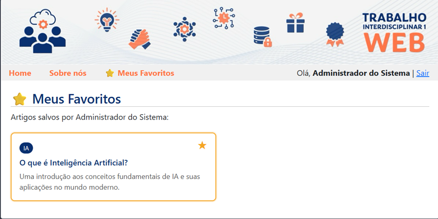

[](https://classroom.github.com/a/rddAc[...]

# Trabalho Prático - Semana 15

Nesta atividade, vamos integrar ao projeto o módulo de login, cujo código já é fornecido com o repositório compartilhado para a atividade. A partir dessa integração, vamos implementar uma funci[...]

## Informações do trabalho

- Nome: Enzo Fernandes Alcantara
- Matricula: 908460

**Print da tela com a implementação**

<< Coloque aqui uma breve explicação da implementação feita nessa etapa>>

O projeto integra um módulo de login com uma funcionalidade de favoritos personalizada por usuário.

Módulo de Login
O script login.js foi adaptado para suportar páginas públicas — a home (index.html) e a página "Sobre nós" são acessíveis sem login. A área de usuário no header exibe dinamicamente "Olá, Nome | Sair" quando logado, ou um link "Entrar" quando não logado, usando o objeto usuarioCorrente salvo no sessionStorage.

Funcionalidade de Favoritos
Criado o módulo favoritos.js que gerencia os favoritos de cada usuário. Ao clicar na estrela ★ de um artigo, o sistema verifica se o usuário está logado — se não estiver, exibe um alerta e redireciona para o login. Se estiver logado, o ID do artigo é salvo ou removido do localStorage com a chave favoritos_<idDoUsuario>, garantindo que os favoritos persistam entre sessões e sejam isolados por usuário. Os cards favoritados ficam visualmente marcados com estrela amarela e borda laranja.

Página "Meus Favoritos"
A página modulos/favoritos.html exige login para ser acessada. Ela lê os IDs salvos no localStorage do usuário logado, busca os dados completos dos artigos na API e exibe apenas os itens favoritados. O usuário pode remover favoritos diretamente nessa página clicando na estrela.

<<  COLOQUE A IMAGEM TELA 1 AQUI (Mostrando seu marcador de favoritos)>>

<<  COLOQUE A IMAGEM TELA 2 AQUI >>

